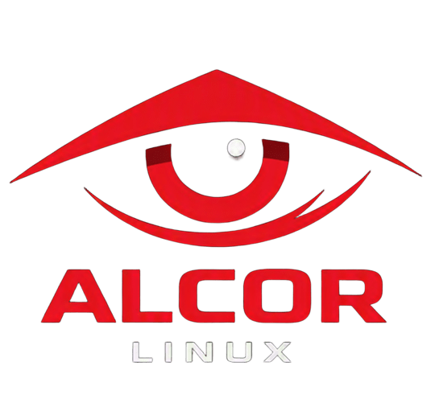

<div align="center">



# ALCOR GNU/LINUX

### Build a system with intent.

An independent, lightweight Arch-based GNU/Linux environment for operators, developers and security enthusiasts.

<p>
  <a href="https://github.com/laplace-daemon14/AlcorLinux/releases#release-Alpha2.0"></a>
  <a href="https://github.com/laplace-daemon14/AlcorLinux-TRY"></a>
  <a href="https://github.com/laplace-daemon14/AlcorLinux"></a>
</p>

</div>

---

## ABOUT THE OPERATOR

<table>
<tr>
<td width="230" valign="top" align="center">


**ALTAIR / ALCOR**  
`BUILDING IN PUBLIC`

</td>
<td valign="top">

Security-minded systems, built from the ground up.

- 🛡️ Active in cybersecurity for **4 years**.
- 💿 Developing custom Linux distributions for **1 year**.
- 🧭 Focused on practical tooling, clean systems and operator control.

### I KNOW


### CURRENTLY LEARNING


</td>
</tr>
</table>

---

## WHAT IS ALCOR?

Alcor GNU/Linux is an independent, offensive security-focused and lightweight operating system built on a robust Arch Linux base. It is designed for enthusiasts, developers and penetration testers who want a fast, clean and highly customizable environment without unnecessary system bloat.

> **Independent does not mean disconnected.**  
> Alcor uses Arch as a foundation while maintaining its own identity, configuration ecosystem, installer roadmap and sandboxed toolsets.

## THE ALCOR METHOD

| 01 / CLEAN HOST | 02 / ISOLATED TOOLS | 03 / PROFILE-DRIVEN | 04 / OPERATOR CONTROL |
| --- | --- | --- | --- |
| Keep the base system focused. | Let Algol carry the heavy toolkit. | Choose Pentest, Daily, Carma or Expert. | See and control the deployment before boot. |

## WHAT WE OFFER

- **Arch Linux Base**: Rolling software, AUR access and a reliable foundation.
- **Custom Boot Experience**: A tailored Plymouth startup animation.
- **Optimized Environment**: Lightweight XFCE with pre-configured Zsh and fastfetch.
- **Offensive Security Ready**: Security tooling organized through isolated containers.
- **Profile-Based Deployment**: Different system signatures for different workflows.
- **Algol Environment**: A Distrobox-based container for security and specialist packages.

## PROFILE SYSTEM

| Profile | Character | Default kernel |
| --- | --- | --- |
| **AlcorPentest** | Recon, web testing, wireless and offensive security | `linux` |
| **AlcorDaily** | Work, gaming, media and development | `linux-zen` |
| **AlcorCarma** | Combined security and daily environment | `linux-lts` |
| **AlcorExpert** | Advanced kernel, firewall and infrastructure choices | `linux-hardened` |

## QUICK START

```bash
git clone https://github.com/laplace-daemon14/AlcorLinux.git
cd AlcorLinux
```

For the latest public release, open the Alpha 2.0 release page:

[](https://github.com/laplace-daemon14/AlcorLinux/releases#release-Alpha2.0)

> Download the ISO from the release assets and verify the published checksum before writing it to a USB drive.

## INSTALLER WORKFLOW

```text
1. Choose a deployment profile
2. Select packages and kernel settings
3. Review the deployment summary
4. Start Calamares
5. Initialize the Algol environment after first boot
```

The installer writes the selected deployment to:

```text
/etc/alcor/selection.txt
/etc/alcor/expert.conf
```

## SCRIPT LAB

The deployment flow is built around small, inspectable scripts:

| Script | Role |
| --- | --- |
| `alcor_frontend.py` | PyQt6 profile and package selection interface |
| `algol-init` | Creates and initializes the Algol Distrobox environment |
| `pacman` | Routes selected security packages into Algol |
| `alcor_backend.sh` | Installs the deployment files into the Calamares target |

[](https://github.com/laplace-daemon14/AlcorLinux/tree/main/Script)

## SYSTEM REQUIREMENTS

- **Architecture:** x86_64
- **Memory:** 4 GB RAM minimum
- **Storage:** 30 GB free space recommended
- **Network:** Required for ISO packages, container images and Algol initialization
- **Boot:** UEFI recommended

## ROADMAP

- [x] Alpha 1.0 source foundation
- [x] Alpha 2.0 deployment profiles
- [x] Algol container workflow
- [ ] Beta hardware coverage
- [ ] Installer hardening and mirror support
- [ ] Stable release

## CHANGELOG

### Alpha 2.0

- Added Pentest, Daily, Carma and Expert deployment profiles.
- Added kernel-aware configuration for standard, Zen, Hardened and LTS targets.
- Added Algol Distrobox initialization and package routing.
- Added deployment summary and Expert configuration output.

### Alpha 1.0

- Initial public source foundation.
- First installer and deployment scripts.
- Arch-based Alcor identity and configuration direction.

## FAQ

<details>
<summary>What is Algol?</summary>

Algol is Alcor's isolated Distrobox environment for security-heavy and specialist packages. It helps keep the host system focused while exposing useful tools when needed.

</details>

<details>
<summary>Which profile should I choose?</summary>

Choose **Pentest** for security assessment, **Daily** for everyday work and gaming, **Carma** for a combined setup, or **Expert** when you want direct control over kernel and system posture.

</details>

<details>
<summary>Does Alcor require an internet connection?</summary>

Yes. The installation and first Algol initialization need network access to fetch repositories, container images and selected packages.

</details>

<details>
<summary>Where can I report a problem?</summary>

Open an issue with your profile, kernel selection, hardware details and the relevant terminal output.

</details>

## COMMUNITY

- [Main repository](https://github.com/laplace-daemon14/AlcorLinux)
- [Issues](https://github.com/laplace-daemon14/AlcorLinux/issues)
- [Discussions](https://github.com/laplace-daemon14/AlcorLinux/discussions)
- [Try AlcorLinux](https://github.com/laplace-daemon14/AlcorLinux-TRY)
- [Alpha 2.0 release](https://github.com/laplace-daemon14/AlcorLinux/releases#release-Alpha2.0)

## LICENSE

License information will be added with the stable project release.
